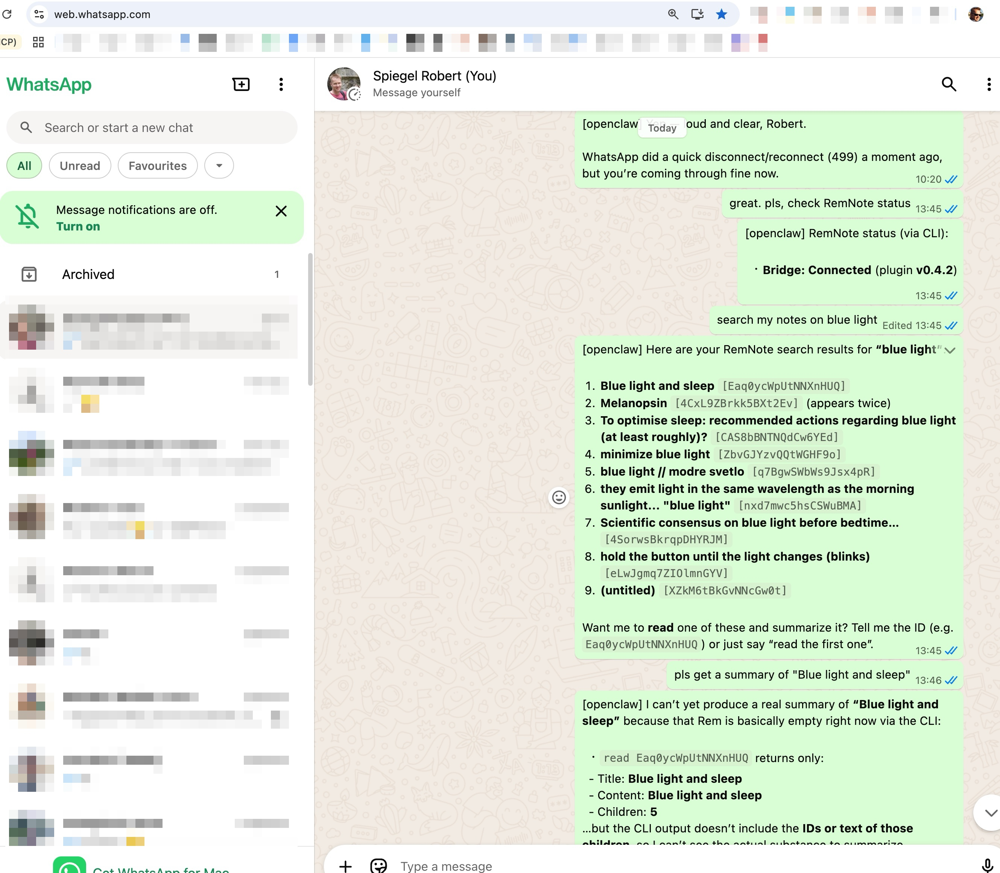

# Demo

Terminal demonstration of `remnote-cli` against a live RemNote + Bridge plugin setup.

## Example of OpenClaw Chat Workflow with `remnote-cli`

This screenshot shows OpenClaw driving `remnote-cli` from a WhatsApp chat: it checks bridge connectivity, runs a
`search` for "blue light", returns matching note IDs, and then attempts a `read`-based summary. The flow highlights
agent-to-CLI orchestration, quick status verification, and transparent handling when note content is incomplete.

Note: reading a full REM with complete children content is not available yet via the bridge. This needs improvement in
[RemNote Bridge plugin](https://github.com/robert7/remnote-mcp-bridge).

## CLI Startup, Connection, and Search

This session shows a realistic first-run sequence:

1. `remnote-cli daemon start` starts the daemon (`wsPort: 3002`, `controlPort: 3100`).
2. An immediate `remnote-cli search "AI"` fails with plugin-not-connected error.
3. `remnote-cli status` then reports `connected: true` with `pluginVersion: "0.4.2"`.
4. `remnote-cli status --text` confirms the same in human-readable output.
5. `remnote-cli search "AI"` succeeds and returns matching notes in JSON.

What this demonstrates:

- Daemon startup and plugin connection are separate states.
- JSON-first output is useful for automation and agent workflows.
- `status` and `status --text` are quick diagnostics when search/create calls fail.

