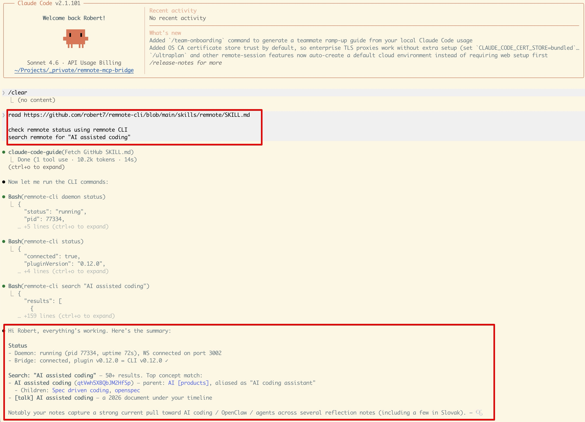
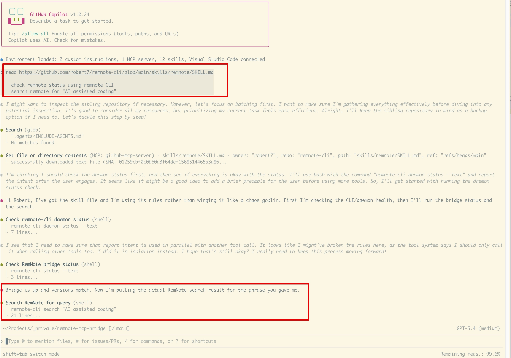
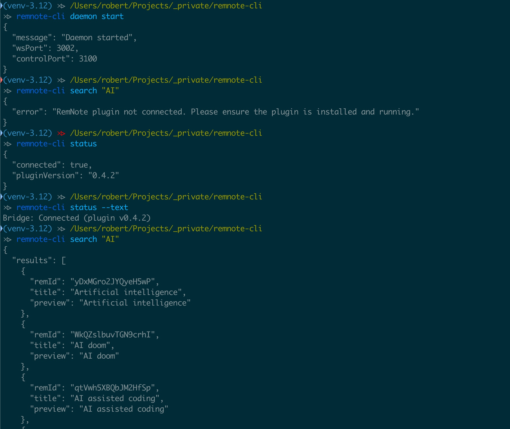

# Demo

Demonstration of `remnote-cli` against a live RemNote + RemNote Automation Bridge plugin setup.

## Use RemNote from Any Coding Harness

No MCP server config needed. In any coding harness — Claude Code, GitHub Copilot CLI, Codex CLI, or similar — you
can interact with RemNote by pasting a single prompt that loads the skill and drives the CLI.

### Before you start

> **Same machine required.** The coding harness must run on the same machine as `remnote-cli` and the CLI daemon.
> Cloud-based harnesses (Claude Cowork, ChatGPT) cannot reach a local daemon — this approach is for locally running
> tools only.

1. **Install `remnote-cli` globally** on the same machine as the coding harness — see
   [Quick Start](https://github.com/robert7/remnote-cli#quick-start) in the README.
2. **Start the daemon:** `remnote-cli daemon start`
3. **Verify the bridge is connected:** `remnote-cli status --text`

### How it works

1. Paste the prompt below into your coding harness.
2. The harness fetches
   [SKILL.md](https://github.com/robert7/remnote-cli/blob/main/skills/remnote/SKILL.md) — a concise guide that tells
   the agent how to use `remnote-cli`.
3. The agent runs CLI commands against your local RemNote bridge.

No config files, no MCP server setup.

### Example prompt

```text
read https://github.com/robert7/remnote-cli/blob/main/skills/remnote/SKILL.md

check remnote status using remnote CLI
search remnote for "AI assisted coding"
```

### Claude Code



Claude Code fetches SKILL.md via an agent subcommand, verifies daemon and bridge status, then searches RemNote — all
in one turn, no prior MCP configuration.

### GitHub Copilot CLI



Same prompt in GitHub Copilot CLI. It fetches SKILL.md via the GitHub MCP tool, checks daemon and bridge status, and
runs the search. The same approach works in VS Code Copilot and other harnesses that can read URLs.

## Example of OpenClaw Chat Workflow with `remnote-cli`


This screenshot shows [OpenClaw](https://github.com/openclaw/openclaw) driving
`remnote-cli` from a WhatsApp chat: it checks bridge connectivity, runs a
`search` for "blue light", returns matching note IDs, and then attempts a `read`-based summary. The flow highlights
agent-to-CLI orchestration, quick status verification, and transparent handling when note content is incomplete.

### OpenClaw YouTube Summary Saved to RemNote Journal


This screenshot shows [OpenClaw](https://github.com/openclaw/openclaw)
working through a Discord interface to create a YouTube video summary and store the result as
a **RemNote journal entry**. The summary content itself was generated with [summarize.sh](https://summarize.sh/) before
being passed into RemNote through the OpenClaw workflow.

Command: `remnote-cli journal --content-file summarize-output-n1e9-med.md --no-timestamp`

## CLI Startup, Connection, and Search



This session shows a realistic first-run sequence:

1. `remnote-cli daemon start` starts the daemon (`wsPort: 3002`, `controlPort: 3100`).
2. An immediate `remnote-cli search "AI"` fails with plugin-not-connected error.
3. `remnote-cli status` then reports `connected: true` with `pluginVersion: "0.4.2"`.
4. `remnote-cli status --text` confirms the same in human-readable output.
5. `remnote-cli search "AI"` succeeds and returns matching notes in JSON.

What this demonstrates:

- Daemon startup and plugin connection are separate states.
- JSON-first output is useful for automation and agent workflows.
- `status` and `status --text` are quick diagnostics when search/create calls fail.
